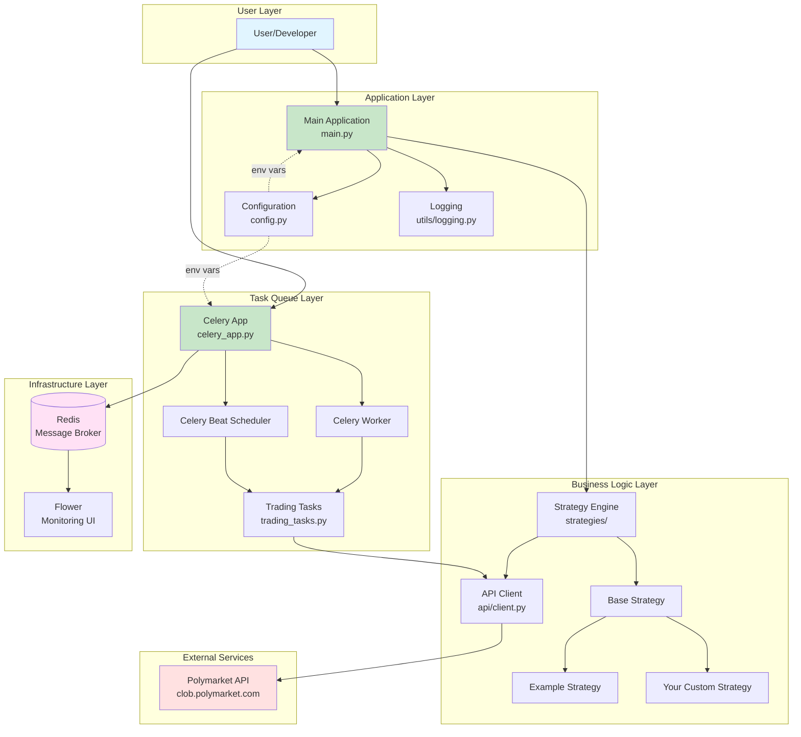
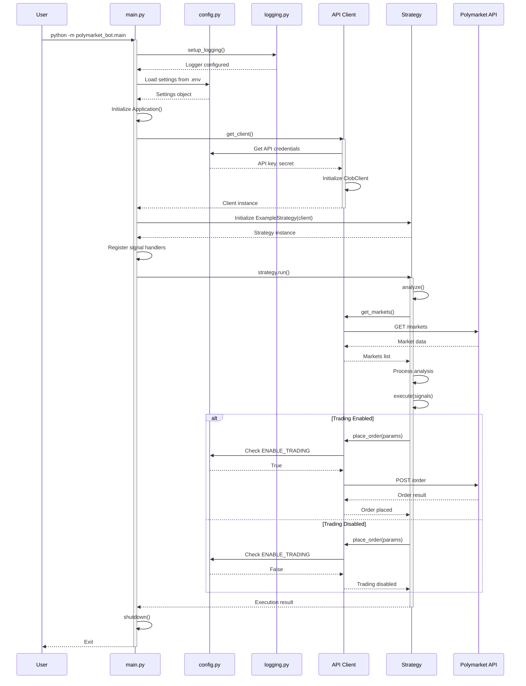
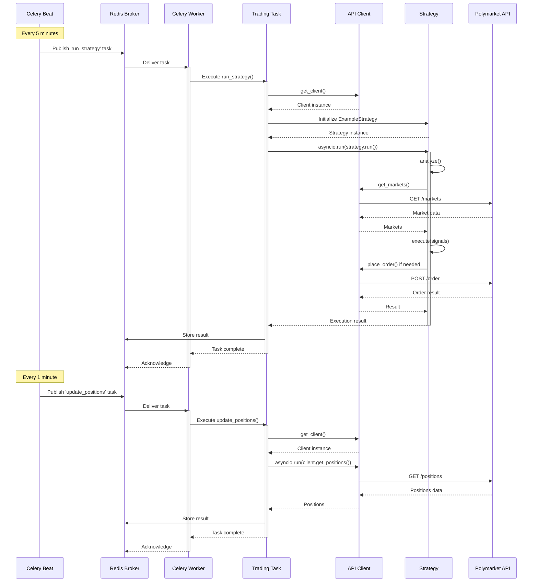
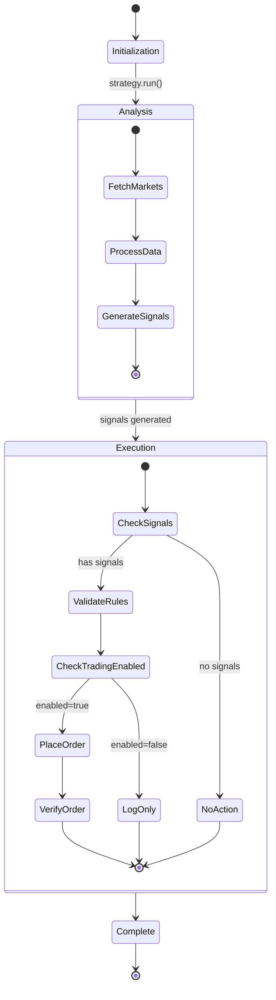
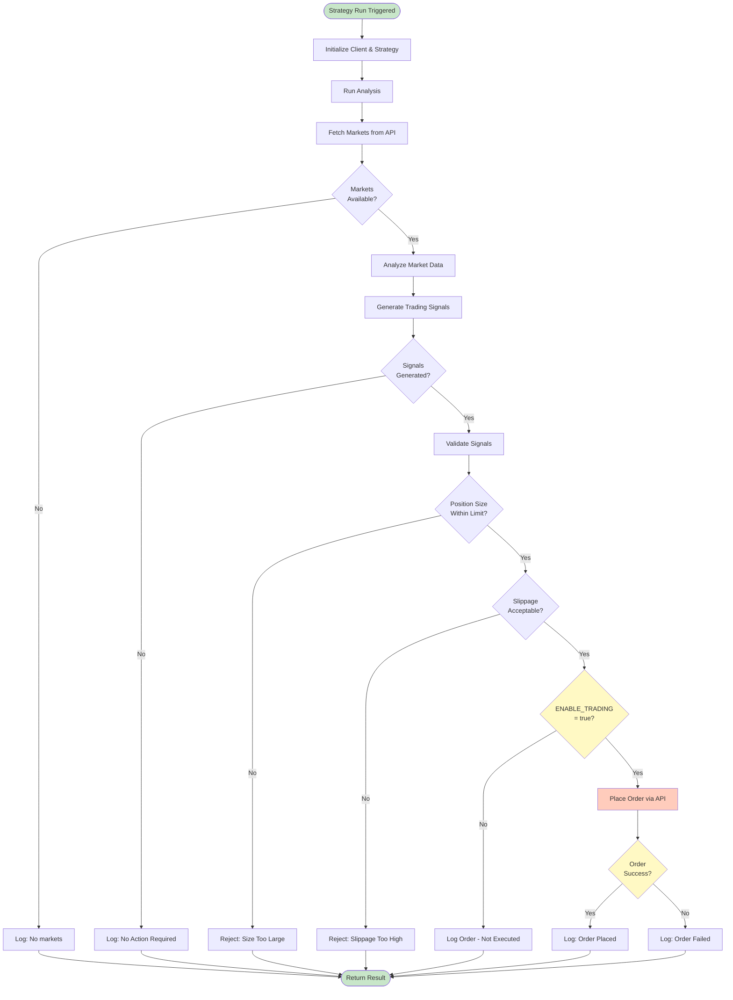
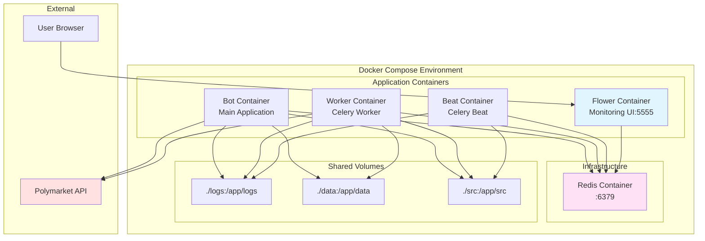
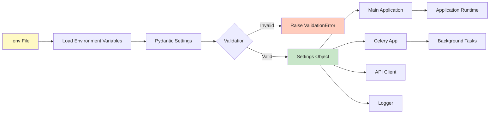
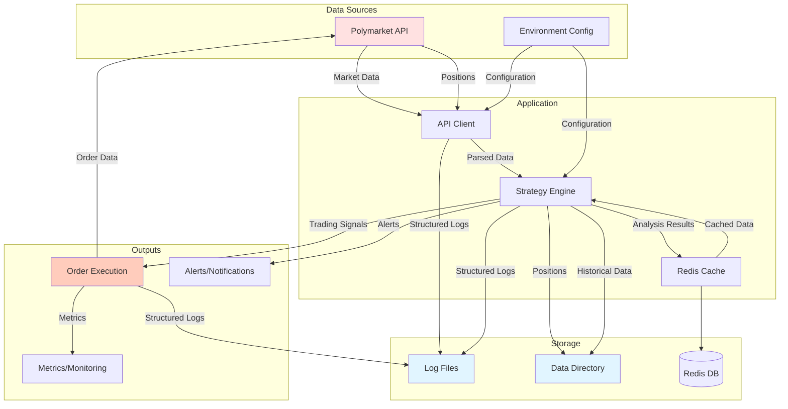
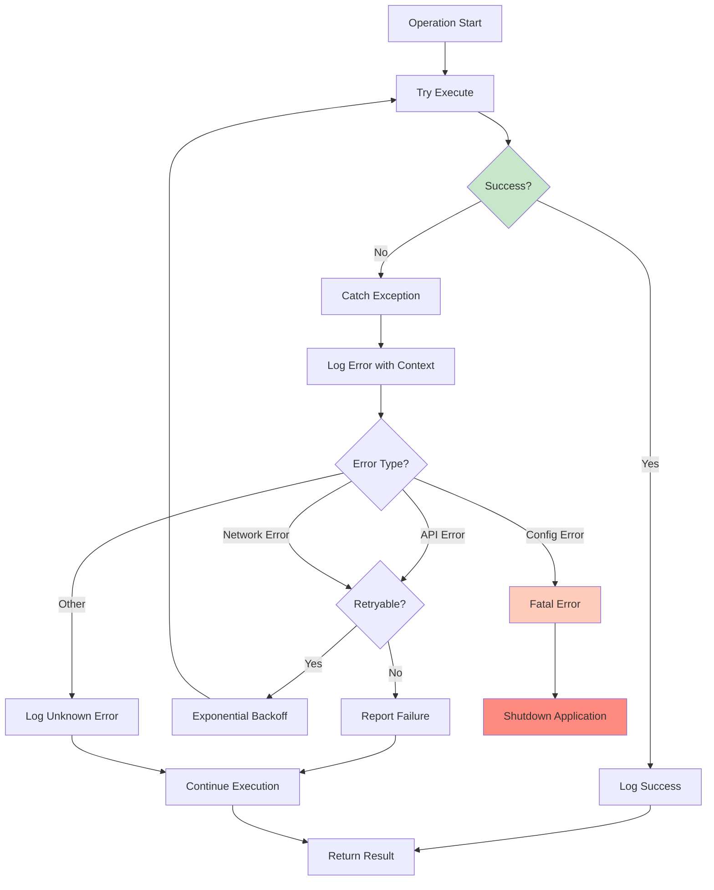
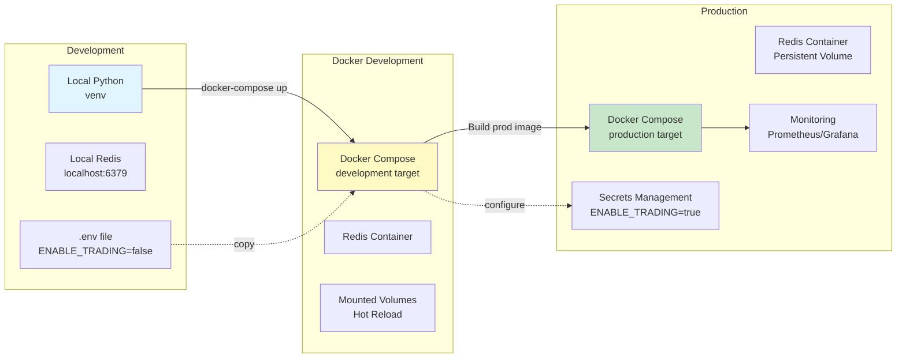

# Polymarket Bot - Architecture & Execution Diagrams

## 1. System Architecture Overview



## 2. Main Application Execution Flow



## 3. Celery Background Task Execution



## 4. Strategy Lifecycle



## 5. Trading Flow Decision Tree



## 6. Docker Container Orchestration



## 7. Configuration Flow



## 8. Data Flow Diagram



## 9. Error Handling Flow



## 10. Deployment Transition



## Execution Modes

### Mode 1: One-Time Execution
```bash
python -m polymarket_bot.main
```
- Runs strategy once
- Logs results
- Exits

### Mode 2: Scheduled Execution (Celery)
```bash
# Terminal 1
celery -A polymarket_bot.tasks.celery_app worker

# Terminal 2
celery -A polymarket_bot.tasks.celery_app beat
```
- Runs strategy every 5 minutes
- Updates positions every minute
- Runs continuously

### Mode 3: Docker Orchestration
```bash
docker-compose up
```
- All services start together
- Auto-restart on failure
- Shared networking
- Persistent storage

## Key Integration Points

1. **Configuration**: All components read from `config.py` → `.env`
2. **Logging**: All components use `structlog` → `logs/bot.log`
3. **API Client**: Singleton pattern ensures single instance
4. **Task Queue**: Redis coordinates between Celery components
5. **Monitoring**: Flower provides visibility into task execution
6. **Docker**: Containers share network and volumes

## Critical Paths

### Trading Path
`.env` → `config.py` → `API Client` → `Strategy` → `Polymarket API`

### Monitoring Path
`Task Execution` → `Redis` → `Flower UI` → `User`

### Logging Path
`All Components` → `structlog` → `logs/bot.log` → `Analysis`
